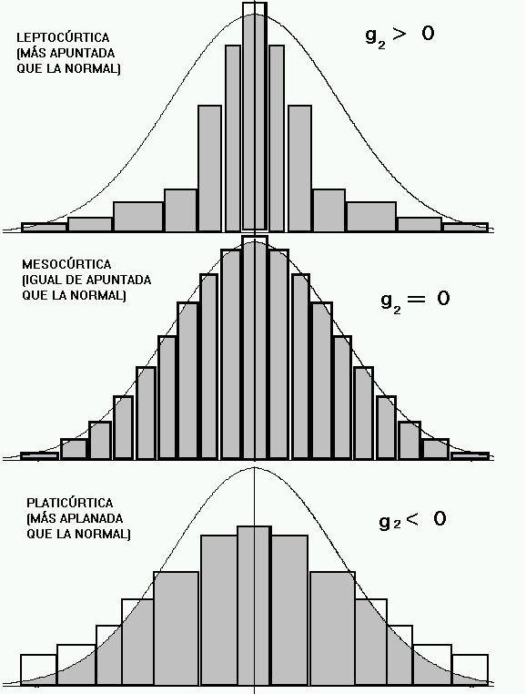

# 📐 Curtosis: ¿Qué es y para qué sirve?

La **curtosis** es una medida estadística que describe la **forma de las colas** de una distribución de probabilidad, en comparación con una distribución normal.

Se enfoca principalmente en:
- La **altura del pico central** de la distribución.
- El **peso de las colas** (es decir, qué tan probables son los valores extremos).

---

## 📊 Tipos de curtosis

| Tipo de curtosis    | Valor típico         | Característica                           |
|---------------------|----------------------|-------------------------------------------|
| **Mesocúrtica**     | Curtosis = 3         | Pico y colas similares a la normal.       |
| **Leptocúrtica**    | Curtosis > 3         | Pico alto, colas pesadas (más extremos). |
| **Platicúrtica**    | Curtosis < 3         | Pico bajo, colas ligeras (menos extremos).|

> 🔸 Algunas fuentes usan **curtosis excesiva**, que es simplemente:
> 
> $$
> \text{Curtosis excesiva} = \text{Curtosis} - 3
> $$
> 
> En este caso, una distribución normal tiene curtosis excesiva igual a **0**.

---

## 📈 Comparación visual

A continuación se muestra un gráfico con los tres tipos de curtosis:

---

## 🧠 Interpretación práctica

- Una distribución con **alta curtosis (leptocúrtica)** tiene más probabilidad de generar valores extremos o atípicos.
- Una distribución con **baja curtosis (platicúrtica)** tiene una dispersión más uniforme, con menos valores extremos.

---

## 🧪 Fórmula general (curtosis poblacional)

Para una variable aleatoria $X$ con media $\mu$ y desviación estándar $\sigma$:

$$
\text{Curtosis} = \frac{\mathbb{E}[(X - \mu)^4]}{\sigma^4}
$$

---
